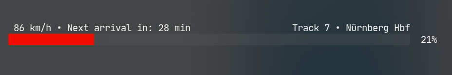

# `iceportal-api` and `iceportal-cli`

`iceportal-api` is a Golang client implementation to interact with the REST
API of `iceportal.de` when connected to the WiFi-Network offered in German ICE
Trains.

`iceportal-cli` offers a nice visual representation of some of the fetched information.



You can pick between one of two themes: `portal` and `delay`. The `portal` theme
is the default one and looks like the screenshot above. The `delay` theme colors
the progress bar according to the delay of the train: Green for no delay, red for
a delay.

You can get `iceportal-cli` by running: 

```
go install github.com/craftamap/iceportal-api/cmd/iceportal-cli
```
